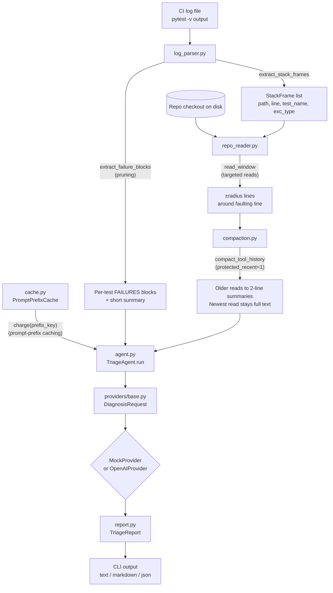

# ci-triage-agent

A **real** CI test-failure triage agent: it reads an actual pytest log and an
actual repo checkout on disk, resolves each failure to its faulting line, and
asks a pluggable diagnosis provider (a deterministic offline `MockProvider`,
or a real `OpenAIProvider` over HTTP) to explain the bug and suggest a fix -
using a fraction of the tokens a naive "dump everything into the prompt"
agent would need.

This is a standalone, dedicated project. It is a sibling to (and shares the
same four token-efficiency *ideas* as) the `tokenmax` demo scenario at the
repo root, but everything here is grounded in genuine data instead of an
in-memory synthetic construct:

| | `tokenmax` scenario (repo root) | `ci-triage-agent` (this project) |
|---|---|---|
| CI log | synthetically generated in-memory | **actually captured** by running `pytest -v` on a real toy repo |
| Repo files | a `dict[str, list[str]]` of strings | **real `.py` files on disk**, read via `Path` |
| Diagnosis | not produced (token accounting only) | a real rule-based `MockProvider`, or a real HTTP call to an OpenAI-compatible endpoint |
| Cache | in-memory, one run vs. the next | a JSON file on disk, so warmth genuinely persists across separate CLI invocations (separate CI jobs) |

## Install

```powershell
cd ci-triage-agent
..\.venv\Scripts\python.exe -m pip install -e ".[dev]"
```

(Reuses the repo's existing `.venv`; a dedicated venv works the same way.)
Add the `tiktoken` extra (`.[tiktoken]`) for exact, provider-accurate token
counts - without it, a documented word-count heuristic is used instead, same
honesty pattern as the rest of this repo.

## Run it

```powershell
ci-triage-agent run --log examples\sample_ci.log --repo examples\sample_repo
```

`examples/sample_ci.log` is a **real, captured** pytest run (`pytest -v`) of
`examples/sample_repo`, a small toy "orders/payments/inventory" service with
four genuine, intentional bugs (a `ZeroDivisionError`, two `KeyError`s, and
an `IndexError`) plus 3,000 real parametrized passing tests, so the log is
CI-scale (3,150 lines) rather than a toy-sized handful of lines.

Flags: `--provider {mock,openai}` (mock is default, fully offline),
`--format {text,markdown,json}`, `--radius N` (read-window size),
`--cache-state PATH` / `--fresh-cache`, and `--no-pruning` /
`--no-targeted-reads` / `--no-compaction` / `--no-prompt-cache` to disable
each technique individually.

## Real measured numbers

From actually running the command above against the checked-in log and repo:

| Run | Total tokens | vs. naive | Estimated cost* |
|---|---:|---:|---:|
| Naive (full log + full repo dump, every call) | 73,134 | - | $0.3072 |
| Optimized, cold cache (first CI run of the day) | 5,738 | **92.15% saved** | $0.0241 |
| Optimized, warm cache (next CI run) | 5,605 | **92.34% saved** | $0.0235 |

\* Illustrative only, at `$0.0042 / 1k tokens` - not tied to any vendor's
live pricing; see `estimate_cost_usd` in `report.py`.

All four failures are correctly resolved to their real `(path, line)` and
given a concrete diagnosis in every run above - the savings do not come at
the expense of the triage result.

### Real-world pricing

The table above uses the repo's illustrative flat rate (`estimate_cost_usd`
in `report.py`), which only counts input tokens. Re-running the same command
with the `tiktoken` extra installed gives exact counts; applying them to
Azure OpenAI's GPT-4o-mini pricing as of August 2026 - $0.15 / 1M input
tokens, $0.60 / 1M output tokens
([source](https://azure.microsoft.com/en-us/pricing/details/azure-openai/))
- and the measured ~339 output tokens for the 4 diagnoses (the model's
answer length, which none of the four techniques touch):

| Run | Input tokens | Output tokens | Total cost | vs. naive |
|---|---:|---:|---:|---:|
| Naive | 82,817 | 339 | $0.01263 | - |
| Optimized, cold cache | 5,244 | 339 | $0.00099 | **92.2% saved** |
| Optimized, warm cache | 5,141 | 339 | $0.00097 | **92.3% saved** |

Total savings (~92%) run slightly below the input-token savings (~94%)
because output tokens are a fixed cost none of the techniques reduce.
Extrapolated to CI volume at this repo's size:

| Triage runs/month | Naive cost | Optimized cost | Saved |
|---:|---:|---:|---:|
| 100 | $1.26 | $0.10 | $1.16 |
| 1,000 | $12.63 | $0.99 | $11.64 |
| 10,000 | $126.30 | $9.90 | $116.40 |

These dollar amounts are small because `examples/sample_repo` is tiny. The
percentage savings is the durable result: naive cost scales with total repo
size (it dumps every `.py` file) and log size, while optimized cost scales
with only the number of failures x a fixed read window - independent of
repo size. On a real repo with thousands of files, the gap widens, not
narrows.

## Architecture



| Module | Responsibility |
|---|---|
| `log_parser.py` | Prune a real pytest log to its `FAILURES` blocks and resolve each failure to a `StackFrame` (path, line, test name, exception) |
| `repo_reader.py` | Read source from the real repo checkout: bounded windows or whole files |
| `compaction.py` | Collapse earlier per-failure reads to 2-line summaries; keep only the most recent at full fidelity |
| `cache.py` | Track prompt-prefix warmth across calls and across separate CLI invocations (a JSON file on disk) |
| `tokens.py` | Count tokens with `tiktoken` if installed, else a documented word-count heuristic |
| `providers/` | Pluggable diagnosis backends: `MockProvider` (offline, rule-based) and `OpenAIProvider` (real HTTP call) |
| `agent.py` | Orchestrates parsing, reads, compaction, caching, and the provider into one triage run |
| `report.py` | Renders a `TriageReport` as text/Markdown/JSON and estimates illustrative USD cost |
| `cli.py` | `argparse`-based entry point (`ci-triage-agent run ...`) |

See [docs/ARCHITECTURE.md](docs/ARCHITECTURE.md) for the full data model,
a step-by-step `TriageAgent.run()` walkthrough, and extension points.

## The four techniques, and where they live

| Technique | What it does here | Implementation |
|---|---|---|
| Pruning | Regex-extracts just the `FAILURES` blocks + short summary from the real log, discarding thousands of `PASSED` lines | `log_parser.extract_failure_blocks` |
| Targeted reads | Reads only `±radius` lines around the real faulting line from the real file on disk, not the whole file | `repo_reader.read_window` |
| Prompt-prefix caching | Charges the static system prompt + repo conventions at full price once, then a fixed discount on every later call - **persisted to a JSON file on disk**, so a second real CI run sees a genuinely warm cache | `cache.PromptPrefixCache` (`CACHE_READ_DISCOUNT = 0.1`) |
| Compaction | After each per-failure tool call, every earlier read collapses to a 2-line summary; only the most recent stays full-fidelity | `compaction.compact_tool_history` / `summarize_tool_output` |

`agent.TriageAgent.run()` ties these together, one model call per failing
test; `agent.TriageAgent._naive_total_tokens()` computes the same
counterfactual "what would a naive agent have spent" baseline used above.

## Tests

```powershell
..\.venv\Scripts\python.exe -m pytest -q
```

37 tests, fully offline (the real `OpenAIProvider` is never exercised by the
suite - only its "missing API key" error path is), running against the real
checked-in `examples/sample_repo` and `examples/sample_ci.log` fixtures.
