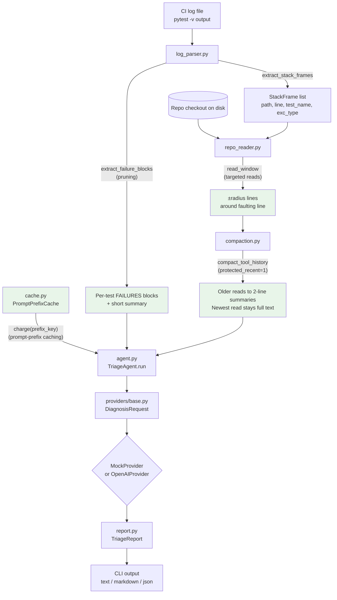
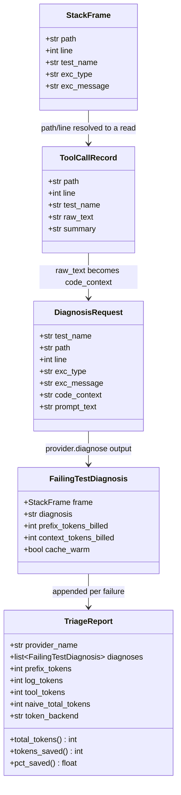

# ci-triage-agent Architecture

This document describes how `ci-triage-agent` is put together: the modules,
the data that flows between them, and the design rationale behind each of
the four token-efficiency techniques it demonstrates. It complements the
[README](../README.md), which covers install/run instructions and measured
results; this document focuses on *how* and *why*.

## Goals and non-goals

- **Goal:** triage real pytest failures against a real repo checkout,
  producing a concrete `(path, line)` + root-cause + fix for each failure,
  while spending as few LLM tokens as possible per run.
- **Goal:** every technique must be independently toggleable (`--no-pruning`,
  `--no-targeted-reads`, `--no-compaction`, `--no-prompt-cache`) so its
  individual contribution to the token savings is measurable, not just the
  combined effect.
- **Non-goal:** this is not a general-purpose coding agent. It has one job
  (diagnose failing tests from a log + a checkout) and one tool
  (a bounded file-window read).
- **Non-goal:** the `MockProvider`'s rule-based diagnoses are illustrative,
  not a replacement for a real model; `OpenAIProvider` exists for that.

## High-level flow

Green boxes mark where a token-efficiency technique actually reduces what
gets sent to the model, versus the naive counterfactual computed by
`TriageAgent._naive_total_tokens()` (full log + full repo dump, prefix never
cached).

## Module map

| Module | Responsibility | Key types/functions |
|---|---|---|
| `log_parser.py` | Parse a real pytest log: prune to FAILURES blocks, resolve each failure to a stack frame | `StackFrame`, `extract_failure_blocks`, `extract_stack_frames` |
| `repo_reader.py` | Read source from a real repo checkout: bounded windows or whole files | `read_window`, `read_whole_file`, `full_repo_dump`, `discover_python_files` |
| `compaction.py` | Collapse earlier tool-call reads to short summaries, keep only the most recent at full fidelity | `ToolCallRecord`, `summarize_tool_output`, `compact_tool_history` |
| `cache.py` | Track prompt-prefix "warmth" across calls and across separate CLI invocations (a JSON file on disk) | `PromptPrefixCache`, `CACHE_READ_DISCOUNT` |
| `tokens.py` | Count tokens with `tiktoken` if installed, else a documented word-count heuristic | `TokenCounter` |
| `providers/base.py` | Provider-agnostic request/response contract | `DiagnosisRequest`, `DiagnosisProvider` (Protocol) |
| `providers/mock.py` | Offline, deterministic, rule-based diagnosis (default) | `MockProvider` |
| `providers/openai_compatible.py` | Real HTTP call to an OpenAI-compatible chat-completions endpoint | `OpenAIProvider`, `MissingApiKeyError` |
| `agent.py` | Orchestrates all of the above into one triage run over one log + one repo | `TriageAgent`, `TriageReport`, `FailingTestDiagnosis` |
| `report.py` | Render a `TriageReport` as text/Markdown, estimate illustrative USD cost | `render_text`, `render_markdown`, `estimate_cost_usd` |
| `cli.py` | `argparse`-based entry point (`ci-triage-agent run ...`) | `build_parser`, `main` |

## Data model

## `TriageAgent.run()` walkthrough

For a given CI log and repo root:

1. **Parse** (`log_parser`): extract per-test `FAILURES` blocks (pruning) and
   resolve every failure to a `StackFrame` (`path`, `line`, `test_name`,
   `exc_type`, `exc_message`) from pytest's location-echo line. This is
   metadata-only and costs no tokens regardless of whether pruning is on.
2. **Per failing test, in report order:**
   - **Targeted read** (`repo_reader.read_window`): read `±radius` lines
     around the reported line from the real file on disk (or the whole file,
     with `--no-targeted-reads`).
   - **Compact** (`compaction.compact_tool_history`): with
     `protected_recent=1`, every prior test's read collapses to its 2-line
     `summary`; only the current test's read is sent at full fidelity.
   - **Charge the prefix** (`cache.PromptPrefixCache.charge`): the static
     system prompt + repo conventions are billed at full price on the first
     call for a given prefix key, and at `CACHE_READ_DISCOUNT` (10%) on every
     later call — including calls from a *previous* CLI invocation, since
     warm keys persist to `--cache-state` (default
     `~/.cache/ci-triage-agent/prefix_cache.json`).
   - **Assemble the prompt**: `prefix + pruned failure block + compacted tool
     history`, and hand it to the configured `DiagnosisProvider`
     (`MockProvider` by default, `OpenAIProvider` with `--provider openai`).
   - Record a `FailingTestDiagnosis` with the diagnosis text and the actual
     billed token counts for prefix/context.
3. **Compute the naive counterfactual** (`_naive_total_tokens`): what a naive
   agent would have spent sending the *unpruned* log plus a full dump of
   *every* `.py` file in the repo, with the prefix billed fresh every call
   (no caching). This is the baseline the README's "vs. naive" percentages
   are measured against.
4. Return a `TriageReport`; `cli.py` renders it as `text`, `markdown`, or
   `json`.

## The four techniques

| # | Technique | Mechanism | Toggle | Module |
|---|---|---|---|---|
| 1 | Pruning | Regex-isolate `FAILURES` sub-blocks + short summary from a log that may contain thousands of `PASSED` lines | `--no-pruning` | `log_parser.py` |
| 2 | Targeted reads | Read only a bounded line window around the faulting line, not the whole file or repo | `--no-targeted-reads` | `repo_reader.py` |
| 3 | Prompt-prefix caching | Bill the static system prompt + repo conventions at full price once per prefix key, then a fixed discount on every later call, persisted to disk so a second CI job sees a real warm cache | `--no-prompt-cache` | `cache.py` |
| 4 | Compaction | After each per-failure tool call, collapse every earlier read to a 2-line summary; keep only the most recent at full fidelity | `--no-compaction` | `compaction.py` |

Each is independently ablatable via the corresponding CLI flag, so the
marginal contribution of any one technique can be measured by diffing
`TriageReport.total_tokens` with and without that flag.

## Provider abstraction

`providers/base.py` defines `DiagnosisProvider` as a `Protocol` with a single
`diagnose(request: DiagnosisRequest) -> str` method, so `TriageAgent` never
depends on a concrete provider:

- `MockProvider` — offline, deterministic, table-driven by `exc_type`
  (`ZeroDivisionError`, `KeyError`, `IndexError`, `AttributeError`,
  `TypeError`, `AssertionError`, plus a generic fallback). Used by the test
  suite and the default CLI experience; makes zero network calls.
- `OpenAIProvider` — a real `httpx` POST to an OpenAI-compatible
  `/chat/completions` endpoint. Requires `OPENAI_API_KEY` (or an explicit
  `api_key`); raises `MissingApiKeyError` otherwise. Never exercised by the
  test suite beyond its missing-key error path.

Adding a third provider (e.g. a different vendor's HTTP API) means
implementing this one method and wiring a new `--provider` choice into
`cli._build_provider` — nothing else in `agent.py`, `report.py`, or the
token-accounting path needs to change.

## Token counting

`tokens.TokenCounter` counts tokens two ways:

- **`tiktoken`** (when the optional `[tiktoken]` extra is installed):
  provider-accurate counts via `tiktoken.encoding_for_model`, falling back to
  `cl100k_base` if the model isn't recognized.
- **Heuristic** (default, zero extra dependencies): `~1.3 tokens per
  word-or-punctuation run`, via a fixed regex tokenization. Documented as an
  approximation, not exact — but stable enough that relative savings
  (naive vs. optimized) hold regardless of which backend is active.
  `TriageReport.token_backend` records which one was used for a given run.

## Persistence: the prompt-prefix cache file

`PromptPrefixCache` is the only stateful component that survives across
process invocations. It stores a JSON array of prefix-key hashes
(`sha256` of the system prompt + repo conventions text) at `--cache-state`
(default `~/.cache/ci-triage-agent/prefix_cache.json`). This is what lets
the README's "cold cache" vs. "warm cache" numbers be genuinely measured
across two separate `ci-triage-agent run` invocations, rather than only
within one process — `--fresh-cache` bypasses this file to simulate a cold
start on demand.

## Extension points

- **New provider**: implement `DiagnosisProvider.diagnose`, add a `cli.py`
  branch.
- **New CI log format**: replace/extend `log_parser.py`'s regexes; the rest
  of the pipeline only depends on the `StackFrame` and pruned-block
  contracts, not on pytest's exact log syntax.
- **New compaction strategy**: `compact_tool_history` takes a
  `protected_recent` parameter; a different retention policy (e.g. keep the
  last N, or keep by recency-weighted relevance) is a drop-in replacement as
  long as it still returns one string per `ToolCallRecord`.
- **Different cache economics**: `CACHE_READ_DISCOUNT` is a single module
  constant in `cache.py`.
