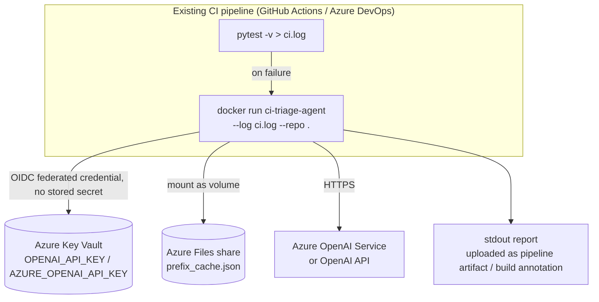
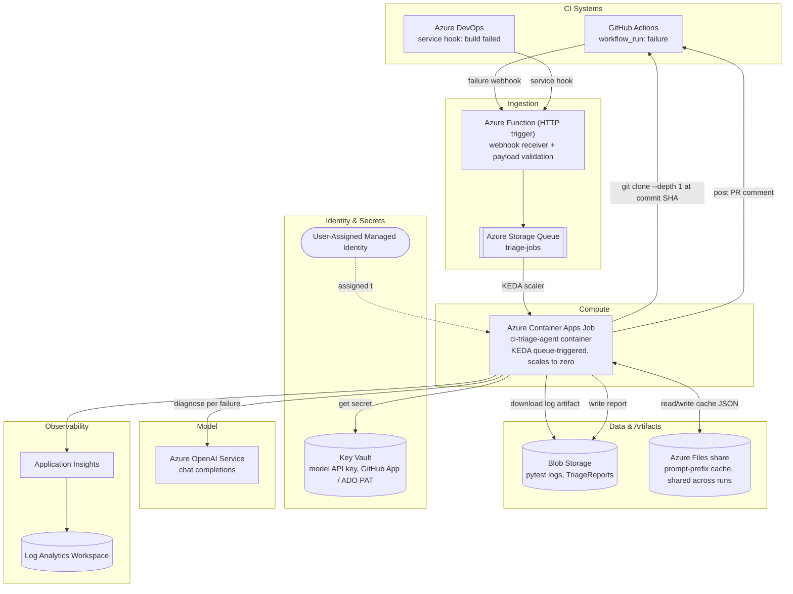
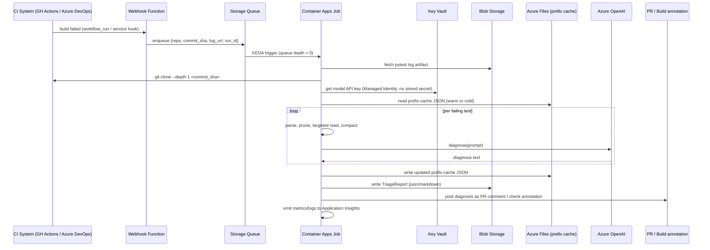

# Azure Hosting Architecture

This document proposes how to host `ci-triage-agent` on Azure. It complements
[ARCHITECTURE.md](ARCHITECTURE.md), which describes the tool's internal
design; this document is about *where it runs, what triggers it, where its
secrets and state live, and what changes to make it cloud-native*.

## Starting point

As of today the repo has **zero deployment artifacts** (no Dockerfile, no
CI workflow, no IaC) and the tool is a synchronous, single-process CLI that:

- runs once per invocation and exits (`ci-triage-agent run --log ... --repo ...`)
- takes a pytest log file and a repo checkout path from local disk — it does
  not talk to any CI system's API itself
- makes at most one external call type: an HTTP POST per failing test to an
  OpenAI-compatible `/chat/completions` endpoint, authenticated by
  `OPENAI_API_KEY`
- has exactly one piece of state that outlives a process: the prompt-prefix
  cache JSON file (default `~/.cache/ci-triage-agent/prefix_cache.json`)
- has no database, no queue, no server socket

This shapes the whole proposal: there's no "lift and shift" of an existing
service — the design choice is *how much of an Azure-native event-driven
shell to build around the existing, unmodified core logic*. Two phases are
proposed below; either can be the final state depending on how many
repos/CI systems need to be served.

## Phase 1 — minimal: run inside the existing CI pipeline

The lowest-effort option: package the tool as a container and invoke it as a
step in whatever pipeline already runs the tests (GitHub Actions or Azure
DevOps), keeping every CI-specific integration out of Azure entirely.

What this needs:

- **Azure Container Registry (ACR)** to host the built image.
- **Azure Key Vault** holding the model API key; the pipeline authenticates
  via GitHub OIDC / Azure DevOps workload identity federation (no long-lived
  secret stored in the pipeline).
- **Azure Files share** mounted at the cache path so "warm cache" survives
  across ephemeral runners — without this, every run is a cold-cache run
  (still correct, just always pays the un-cached prefix rate).
- No new compute service, no event infrastructure, no code changes beyond a
  `Dockerfile`.

This is a reasonable stopping point if the tool is only ever used by the one
or two repos that already run this exact pipeline. It doesn't generalize:
every repo/pipeline that wants triage has to embed the same docker-run step
and manage its own Key Vault wiring.

## Phase 2 — recommended: centralized, event-driven service

To serve many repos/pipelines without duplicating pipeline logic everywhere,
invert the trigger: CI systems notify Azure of a failure, and Azure runs the
triage job centrally.

### Sequence for one triage run

### Component mapping

| Concern | Azure service | Why |
|---|---|---|
| Compute | **Container Apps Jobs** (event-driven, KEDA) | The workload is exactly what jobs are for: short-lived, triggered per event, scale-to-zero, container-native so `pip install` and a real repo checkout on ephemeral disk both just work. Preferred over Azure Functions here because the job needs an arbitrary-duration `git clone` + filesystem access, not a thin HTTP handler. |
| Webhook intake | **Azure Function (HTTP trigger)** | Cheap, stateless payload validation/normalization in front of the queue; keeps the Container Apps Job decoupled from CI-system-specific webhook shapes. |
| Job dispatch | **Storage Queue + KEDA queue scaler** | Simplest reliable at-least-once dispatch primitive; a message per failed build, consumed by exactly one job execution. |
| Model calls | **Azure OpenAI Service** | `OpenAIProvider` already targets an "OpenAI-compatible" endpoint (`providers/openai_compatible.py`); Azure OpenAI exposes the same chat-completions contract, so this is a small provider change (endpoint path + `api-version` query param + `api-key` header) rather than a new integration. Keeps token spend inside the Azure tenant for cost/compliance visibility. |
| Secrets | **Key Vault + User-Assigned Managed Identity** | Model key and any GitHub App/PAT token used to clone/comment are never stored in pipeline config or container env; the job's identity is granted `Key Vault Secrets User` only. |
| Cache persistence | **Azure Files share**, mounted into the job | `cache.py` already just reads/writes one JSON file at a path — mounting a durable share at that path is a zero-code-change way to make "warm cache across CI runs" genuinely durable, matching what `docs/ARCHITECTURE.md` calls "the only stateful component." |
| Log/report storage | **Blob Storage** | Input pytest logs and output `TriageReport` JSON/Markdown land in a container per repo, giving an audit trail and a place other tools (dashboards, Teams digest, etc.) can read from without re-running triage. |
| Observability | **Application Insights + Log Analytics** | Standard Container Apps integration; alert on job failures or elevated token spend. |
| Image registry | **Azure Container Registry** | Holds the built `ci-triage-agent` image; Container Apps Job pulls from here via managed identity (no registry credentials in pipeline). |

### Code changes this implies

None of this requires rearchitecting the tool — it requires a thin operational shell around it:

1. **`Dockerfile`** — package `pip install -e .` (or a wheel build) into a
   slim Python base image; entrypoint stays `ci-triage-agent`.
2. **New `AzureOpenAIProvider`** (or parameterize the existing
   `OpenAIProvider`) — same `diagnose()` contract, different base URL shape
   (`/openai/deployments/{deployment}/chat/completions?api-version=...`) and
   `api-key` header instead of `Authorization: Bearer`.
3. **A small wrapper script** invoked by the Container Apps Job that: reads
   the queue message, fetches the log blob, does the shallow `git clone`,
   invokes `ci_triage_agent.cli.main()` (or calls `TriageAgent` directly) with
   `--cache-state` pointed at the mounted Azure Files path, writes the
   resulting report to Blob Storage, and posts the PR comment. This wrapper
   is new code; the triage engine itself is unchanged.
4. **Optional**: a `--repo-url`/`--commit-sha` mode instead of `--repo <path>`
   so the wrapper doesn't need its own clone logic — this can live in
   `cli.py` as an additional input mode without touching `agent.py`.

Everything in `docs/ARCHITECTURE.md` (pruning, targeted reads, compaction,
prompt-prefix caching) is orchestration-agnostic and needs no change.

### Security

- No secret is stored in pipeline YAML, container env vars, or app
  settings — the job's user-assigned Managed Identity resolves the model key
  and any git token from Key Vault at runtime.
- Grant the Managed Identity the minimum roles: `Key Vault Secrets User` on
  the vault, `Storage Blob Data Contributor` scoped to the specific
  logs/reports containers, `Storage File Data SMB Share Contributor` scoped
  to the cache share.
- If policy requires no public egress, put the Container Apps environment on
  a VNet with Private Endpoints for Key Vault, Storage, and Azure OpenAI;
  the webhook Function can stay public (it only accepts CI-system webhooks)
  or sit behind Azure Front Door/APIM if signature validation and rate
  limiting are needed.
- Validate webhook payloads (GitHub HMAC signature / Azure DevOps shared
  secret) in the Function before enqueuing — this is the only
  externally-reachable surface.

### Cost shape

This is a bursty, per-failure workload, not a steady-state service — the
design should bill (near) zero when idle:

- Container Apps Jobs (Consumption plan) bills per vCPU-second only while a
  job executes — a run over the bundled example (4 failures) completes in
  low single-digit seconds of CPU time plus network wait on the model call.
- Function (HTTP trigger, Consumption) and Storage Queue costs are
  negligible at CI-failure volumes.
- Azure OpenAI token cost is the dominant real cost and is exactly what
  `docs/ARCHITECTURE.md`/README already measure per run
  (~$0.02–0.03/run optimized vs. ~$0.31/run naive, illustrative rate) — the
  architecture doesn't change this, it just relocates where the call
  originates from.
- Blob/Files storage for logs, reports, and the cache file is trivially
  small (KBs–low MBs per run).

### Rollout suggestion

1. Ship Phase 1 first against the one or two repos already using this tool
   in CI — proves out the container image, Key Vault wiring, and Azure
   OpenAI provider swap with minimal new infrastructure.
2. Move to Phase 2 once a second CI system or a third+ repo needs triage,
   or once centralized reporting/PR-commenting is wanted — the webhook
   receiver and job are the same container image, just invoked
   differently, so the migration is additive rather than a rewrite.
3. Author the Phase 2 resources as Bicep (`infra/main.bicep`) so the
   environment is reproducible and reviewable, matching the rest of this
   repo's preference for concrete, verifiable artifacts over prose.
